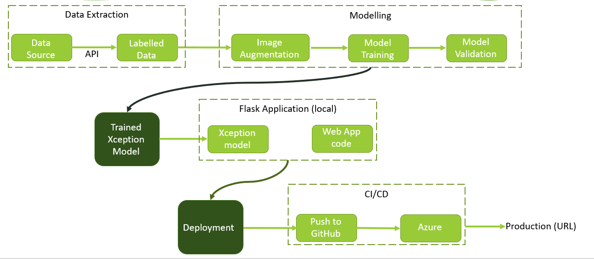
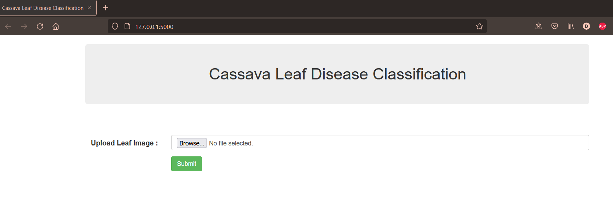
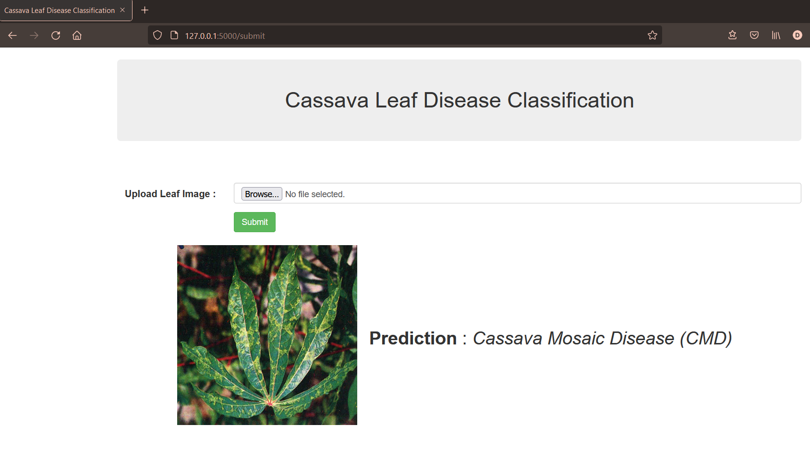

# **Cassava Leaf Classification using Xception neural network**

- Cassava is a perennial plant which is extensively cultivated as an annual crop in tropical and subtropical regions for its edible starchy tuberous root, a major source of carbohydrates.
- It is the third-largest source of food carbohydrates in the tropics, after rice and maize, providing a basic diet for over half a billion people.

### Need for Detection of Diseased plants
- Viral diseases results in poor yields.
- Existing methods of disease detection require farmers and  agricultural experts to visually inspect and diagnose the plants.

### Problem Statement
Classify each Cassava image into four disease categories or a fifth category indicating a healthy leaf.
- Cassava Bacterial Blight (CBB)
- Cassava Brown Streak Disease (CBSD)
- Cassava Green Mottle (CGM)
- Cassava Mosaic Disease (CMD) 
- Healthy

### MLOps Pipeline

### URL
Click here for [Deployed on Azure](https://cassava-classification.azurewebsites.net/ )

## ****** Closed the server due to the end of free trial period. ******

### Working snapshots

